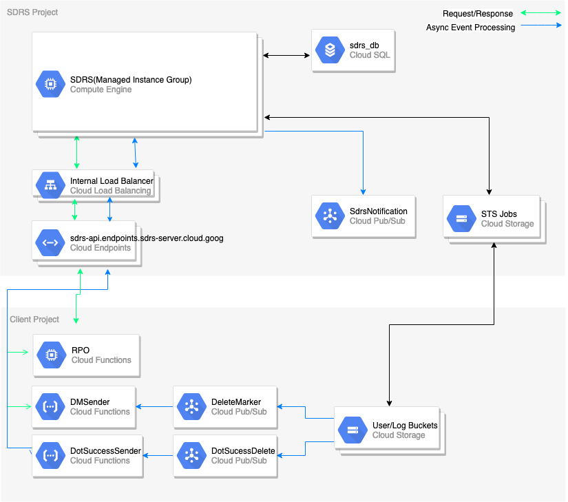

  
# Supplementary Data Retention Service(SDRS) Deployment    
 ## Overview   
This document provides recommended SDRS deployment strategy in Google Cloud Platform(GCP) that meets the common 
enterprise production requirements for high availability, reliability, and security. The summary of the recommendation is as follows:     
* SDRS, a containerized Java server application, is deployed in GCP running on autoscaled Managed Instance Groups(MIG) behind an Internal Load Balancer for availability and reliability.     
* The application exposes services through REST API that is managed by Google Endpoints for authentication and authorization.    
* All VM instances in MIG and Cloud SQL used by SDRS run on private IP.     
* SSL are enabled for HTTP traffic.     
    
## High-level Deployment Architecture   
 The separation of SDRS and Client projects are for simple illustration. The [client](../../sample-client/README-cloudfunctions.md) could be deployed in the same project as SDRS is.     
    
    
    
    
## Prerequisites    
 1. [Google Cloud SDK](https://cloud.google.com/sdk) installed.    
    

## Deployment    
The following sections provide a walkthrough on how to deploy SDRS starting from GCP project creation up to deploying the Endpoints and making updates to the backend software.      
    
### Infrastructure 
Basic infrastructure such as project, network, and service accounts need to be provisioned and configured before the 
SDRS deployment.    
    
#### 1. Create a GCP Project
Create a project to deploy SDRS.   

    gcloud projects create PROJECT_ID
  
    
#### 2. Create VPC Network
    
Create a custom mode VPC via GCP Console or gcloud command. Configure the network based on your requirements

    gcloud compute networks create <YOUR_VPC_NAME> --subnet-mode=custom 

   
    
#### 3. Create a subnet 
Create a subnet and enable [Private Google Access](https://cloud.google.com/vpc/docs/private-access-options#pga). MIG 
uses the subnet and all VM instances in MIG run on private IP only. 

    gcloud compute networks subnet create <YOUR_SUBNET_NAME> \
        --network=<YOUR_VPC_NAME> \
        --region=<YOUR_REGION> \
        --range=<YOUR_IP_CIDR_RANGE> \
        --enable-private-ip-google-access   

    
#### 4. Configure [Private Services Access](https://cloud.google.com/vpc/docs/configure-private-services-access) for CloudSQL   
 
You need to enable Private Services Access in order for CloudSQL to run on private IP.     
 
Considerations:  
- Select a range that doesn't overlap with existing allocated ranges, subnets, or custom static routes. No two ranges can overlap.    
- If you're using an  [auto mode](https://cloud.google.com/vpc/docs/vpc#subnet-ranges)  VPC network, you can't create an allocated range that matches or overlaps with `10.128.0.0/9`. This range is for  [automatically created subnets](https://cloud.google.com/vpc/docs/vpc#ip-ranges).
- Select a CIDR block that large enough to meet your current and future needs. If you later find that the range isn't sufficient in size,  [expand](https://cloud.google.com/vpc/docs/configure-private-services-access#modify-ip-range)  the range if possible. Although you can assign multiple allocations to a single service producer, Google enforces a quota on the number of IP address ranges that you can allocate, not the size (netmask) of each range.    
- Don't reuse the same allocated range for multiple service producers. Although it's possible, doing so can lead to IP address overlap. Each service producer has visibility only into their network and can't know which IP addresses other service producers are using.    
- You can only assign one CIDR block to an allocated range when you create the allocation. If you need to  [expand](https://cloud.google.com/vpc/docs/configure-private-services-access#modify-ip-range)  the IP address range, you can't add more blocks to an allocation. Instead, you can create another allocation or recreate the existing one by using a larger block that encompasses the new and existing ranges.    
    
    
More information on [GCP Regions](https://cloud.google.com/compute/docs/regions-zones/).  

#### 5. Service Account
Create a service account that will be used by SDRS. The credential of the service account is put in a GCS bucket that can only be accessed by the instances where SDRS is being deployed. The [startup script](./mig/scripts/startup.sh), as part of MIG instance creation, gets the credential from the GCS bucket and sets the [GOOGLE_APPLICATION_CREDENTIALS](https://cloud.google.com/docs/authentication/production) environment variable for SDRS docker container.

The service account should have proper permissions to:

* publish to [Pub/Sub topic](https://cloud.google.com/pubsub/docs/access-control)
* create [Storage Transfer Service](https://cloud.google.com/storage-transfer/docs/iam-transfer) jobs.

    
### SDRS Deployment    
The following are instructions to deploy SDRS. Click the links for details on each step:     

1. Create a [CloudSQL](./cloud-sql/README.md) instance. (Takes about 10-15 minutes).
2. Set [log_bin_trust_function_creators](https://stackoverflow.com/questions/47359508/cant-create-trigger-on-mysql-table-within-google-cloud) to true.

        gcloud sql instances patch <CLOUDSQL_INSTANCE_NAME> --database-flags log_bin_trust_function_creators=on

3. Run [SQL DDL](../sql/retention_schema.sql) to create a database schema in Cloud SQL created above.

    > Connecting to Cloud SQL over Private IP will require a bastion host within the VPC or a private connection like VPN from origin to the VPC

    > Once the Cloud SQL is reachable, the below command can be run to create the database schema:

        mysql --host=<CLOUDSQL_PRIVATE_IP> --user=root --password < retention_sdrs.sql


4. Create a [Pub/Sub topic](./pub-sub) for SDRS to publish messages. 
5. Create a [custom image](#custom-image) to be used by MIG.  
6. Create a [Docker Container Image](#docker-container-image) containing SDRS application build.
7. Launch a [Managed Instance Group cluster](./mig/README.md) (Takes about 5 minutes ). This step creates the MIG and deploys SDRS into the MIG.   
    
        Follow the steps section I (subsection 1 through 11) to create a Managed Instance Group.    
   
8. Deploying the [Endpoints configuration](#cloud-endpoints)

9. Verify the status of SDRS using [Check SDRS Status](#check-sdrs-status)

### SDRS Update
If the update requires database changes, run the [database mods](../sql/mods) against the database to update the schema for the updated SDRS version before updating SDRS. The database mods only update schema and data migration maybe needed as part of update.

Update the SDRS application using [MIG Updater](./mig/README.md).    
 
Follow the steps section II (subsection 1 through 4) to update the version of new software on the existing Managed Instance Group.    
 
> Notes:
> 1. The Managed Instance Group updater does NOT cause a change of Internal Load Balancer Private IP Address or Endpoints configuration
> change.    
> 2. The Managed Instance Group Infrastructure is immutable i.e. when you update the MIG with a newer software version the VM instances are
> replaced by the new VM instances running newer software version.    
> 3. You can not stop or restart VM instances in a MIG.

### SDRS JVM Monitoring
The following are instructions to enable Stackdriver monitoring of SDRS JVM environment:
1. Use [startup_with_monitoring.sh](./mig/scripts/startup_with_monitoring.sh) instead of [startup.sh](./mig/scripts/startup.sh) when creating the MIG using the Deployment Manager template.
2. Set ENABLE_JMX=true (set to false by default) inside [env.txt](./mig/scripts/env.txt).
3. If using Stackdriver Monitoring, follow instructions to install stackdriver agent and configure JVM plugin with monitoring port (port 8086 used by default in SDRS setup) and ensure the GCE Instances service account has permissions to access Stackdriver Monitoring.

    > [Stackdriver Monitoring Agent Installation](https://cloud.google.com/monitoring/agent/install-agent)

    > [Stackdriver JVM Plugin Setup](https://cloud.google.com/monitoring/agent/plugins/jvm#enabling_the_jvm_monitoring_plugin)
    
    > [Stackdriver Monitoring Access Control](https://cloud.google.com/monitoring/access-control)

### SDRS Logging
The following are instructions to enable Stackdriver logging on SDRS environment:
1. Install [Stackdriver Logging Agent](https://cloud.google.com/logging/docs/agent/installation)
2. Copy [docker.conf](./mig/stackdriver-logging/docker.conf) to path `/etc/google-fluentd/config.d/` on each instance where SDRS app is running and ensure the GCE Instances service account has permissions to access Stackdriver Logging
3. Make sure the docker command to run SDRS container has `json-file` set as the log driver.
4. Restart the Stackdriver logging agent so that it picks up the new docker.conf logging configuration.

  > [Stackdriver Logging Access Control](https://cloud.google.com/logging/docs/access-control)

## Appendix
### Cloud Endpoints

Cloud Endpoints is a distributed API management system that helps you secure, monitor, analyze, and set quotas on your APIs using the same infrastructure Google uses for its own APIs. Endpoints works with the Extensible Service Proxy (ESP) to provide API management. It provides an API console, hosting, logging, monitoring, and Authenticating API users to help you create, share, maintain, and secure your APIs.    

1. Edit opemapi.yaml file with required details as per comments within the file and save it as my_openapi.yaml file.
2. Run the below gcloud command to deploy the Endpoint service config:

        gcloud endpoints services deploy my_openapi.yaml 

3. You can view the Endpoints service configuration on the Endpoints > Services page in the GCP Console.    
    
#### OpenAPI Configuration    
OpenAPI configuration file, openapi.yaml is based on OpenAPI Specification v2.0.    
    
#### DNS and SSL    

 - Using your [own DNS as the name of your Cloud Endpoints
   Service](https://cloud.google.com/endpoints/docs/openapi/verify-domain-name). If you already own a domain name (such as `mycompany.com`), and you
   want to use this domain name as the name of your Cloud Endpoints
   service, you must prove that you are authorized to use the domain.  
   
 - You may need to enable an SSL port for your deployed Endpoints service so that it can serve HTTPS requests. Refer to [Enabling   SSL](https://cloud.google.com/endpoints/docs/openapi/enabling-ssl)   for Cloud Endpoints for details

### Custom Image
A custom CentOS-7 image needs to be created as it will be used by MIG. This image will have docker pre-installed and the startup script will configure and run SDRS on a docker container.

Follow the instructions to create a custom GCE image:
1.  Create a GCE Instance using CentOS 7 base image. SSH into the instance to run the rest of the commands.
    
2.  Google Cloud SDK is installed by default on the CentOS 7 image available on GCP. Install it if your image does not have it installed already.

3. Install the latest version of docker.
    > [Docker for CentOS Install Guide](https://docs.docker.com/install/linux/docker-ce/centos/#install-docker-ce)
    
4.  Start the docker service.
    ```
    sudo systemctl start docker
    ```    

5.  Start the chkconfig service using below command to make sure the service comes up in case the VM restarts.
    ```
    sudo chkconfig docker on
    ```
    
6.  (Optional) If using Stackdriver Monitoring to monitor JVM then follow the below steps:

    a. Install [Stackdriver Monitoring Agent](https://cloud.google.com/monitoring/agent/install-agent).
    
    b. Configure [Stackdriver JVM Plugin](https://cloud.google.com/monitoring/agent/plugins/jvm#enabling_the_jvm_monitoring_plugin) with monitoring port 8086 (port 8086 used by default in SDRS setup).

7.  (Optional) If using Stackdriver Logging to send SDRS logs to Stackdriver then follow the below steps:

    a.  Install [Stackdriver Logging agent](https://cloud.google.com/logging/docs/agent/installation#joint-install).
    
    b.  Copy [docker.conf](./mig/stackdriver-logging/docker.conf) file to the path `/etc/google-fluentd/config.d/`.

8.  Shut down the instance via GCP Console.
    
9.  Create the image. It typically takes 5-10 minutes for the image creation to complete.
    > Compute Engine → Images → Create Image → Source (Disk) → Source Disk (VM name you just created) → Create

10. Once the image is created you can fetch the image selfLink that will need to be supplied to instance template Deployment Manager config file.
    ```
     gcloud compute images describe <INSTANCE_IMAGE_NAME> --project <YOUR_PROJECT_NAME> | grep selfLink
    ```

### Docker Container Image
The docker container image will contain the SDRS application build and it will be used to deploy SDRS on the MIG cluster. The following steps will let you build the docker image and upload it to GCR repository.

1. Install and setup docker on your development environment
2. Tagging format for images is `[HOSTNAME]/[PROJECT-ID]/[IMAGE_NAME]:[TAG]`
3. Run gcloud command to authorize docker to use your credentials to authenticate with GCR.io

        gcloud auth configure-docker

4. After you have cloned this repository, cd into storage-sdrs

        cd storage-sdrs

5. Build docker container image and wait for it to successfully build the image. (Note the `.` at the end of below command)

        docker build --tag gcr.io/your-project-id/your-sdrs-build:0.1.0 .

6. Push docker image to GCR. Refer to [GCR Documentation for Image management](https://cloud.google.com/container-registry/docs/pushing-and-pulling)
   ```
    docker push gcr.io/your-project-id/your-sdrs-build:0.1.0
   ```
7. Verify the image is uploaded to GCR
   ```
    docker container images list-tags gcr.io/your-project-id/your-sdrs-build
   ```

### Google Project

    gcloud projects create PROJECT_ID

Where PROJECT_ID is the ID for the project you want to create. A project ID must start with a lowercase letter, and can contain only ASCII letters, digits, and hyphens, and must be between 6 and 30 characters.    
    
Each GCP project has:    
    
* A project name, which you provide.    
* A project ID, which you can provide or GCP can provide for you.    
* A project number, which GCP provides.    
    
    
Follow the recommended [security best practices](https://cloud.google.com/iam/docs/using-iam-securely) when using Cloud IAM and Google Cloud in general.    
    
* Principle of least privilege    
* Rotate your service account keys using the [Cloud IAM service account API](https://cloud.google.com/iam/reference/rest/v1/). You can rotate a key by creating a new key, switching applications to use the new key and then deleting old key.    
* Do not delete service accounts that are in use by running instances. This could result in all or parts of your application to fail if you have not transitioned to using an alternative service account first.    
* Don’t check in the service account keys into the source code or leave them in the Downloads directory.    
* Audit who has the ability to change your Cloud IAM policies on your projects.


## Glossary    
 [SDRS](https://github.com/GoogleCloudPlatform/storage-sdrs): Supplementary Data Retention Service    
    
[Managed Instance Group (MIG)](https://cloud.google.com/compute/docs/instance-groups/): A managed instance group is a group of identical instances. You control a managed instance group as a single entity. If you wanted to make changes to instances that are part of a managed instance group, you would make the change to the whole instance group.    
    
[Internal Load Balancing](https://cloud.google.com/load-balancing/docs/internal/): Internal TCP/UDP Load Balancing is a regional load balancer that enables you to run and scale your services behind a private load balancing IP address that is accessible only to your internal virtual machine instances.    
    
[Google Container Registry](https://cloud.google.com/container-registry/): Container Registry is a private container image registry that runs on Google Cloud Platform.    
    
[Google Cloud Storage](https://cloud.google.com/storage/): Cloud Storage allows world-wide storage and retrieval of any amount of data at any time. You can use Cloud Storage for a range of scenarios including serving website content, storing data for archival and disaster recovery, or distributing large data objects to users via direct download.    
    
[Identity and Access Management(IAM)](https://cloud.google.com/iam/) : Cloud IAM, which lets you manage access control by defining who (identity) has what access (role) for which resource. Cloud IAM lets you grant granular access to specific GCP resources and prevent unwanted access to other resources. Cloud IAM lets you adopt the security principle of least privilege, so you grant only the necessary access to your resources.    
    
[Service Account](https://cloud.google.com/iam/docs/service-accounts): A service account is a special Google account that belongs to your application or a virtual machine (VM), instead of to an individual end user. Your application uses the service account to call the Google API of a service, so that the users aren't directly involved.    
    
[Google Cloud SDK](https://cloud.google.com/sdk/): The Cloud SDK is a set of tools for Cloud Platform. It contains gcloud, gsutil, and bq command-line tools, which you can use to access Google Compute Engine, Google Cloud Storage, Google BigQuery, and other products and services from the command-line. You can run these tools interactively or in your automated scripts.    
    
[gcloud](https://cloud.google.com/sdk/gcloud/): The gcloud command-line interface is a tool that provides the primary CLI to Google Cloud Platform. You can use this tool to perform many common platform tasks either from the command-line or in scripts and other automations.    
    
[gsutil](https://cloud.google.com/storage/docs/gsutil): gsutil is a Python application that lets you access Cloud Storage from the command line. It is installed as part of Google Cloud SDK.    
    
[Virtual Private Cloud](https://cloud.google.com/vpc/): Google Cloud Platform (GCP) Virtual Private Cloud (VPC) provides networking functionality to Compute Engine virtual machine (VM)    
    
[Peering](https://cloud.google.com/vpc/docs/vpc-peering): Google Cloud Platform (GCP) Virtual Private Cloud (VPC) Network Peering allows private RFC 1918 connectivity across two VPC networks regardless of whether or not they belong to the same project or the same organization.    
    
[Google Cloud Functions](https://cloud.google.com/functions/): Google Cloud Functions is a lightweight compute solution for developers to create single-purpose, stand-alone functions that respond to Cloud events without the need to manage a server or runtime environment.    
    
[Cloud Function Private VPC connectivity](https://docs.google.com/document/d/1wvLYU21hDGfw3EeisdEq3dVEw9yWBqe9qWmUe4lROXI/edit): This feature lets you connect your Google Cloud Function to resources residing on a VPC network over internal RFC 1918 IP addresses.  
    
[Cloud SQL Private IP Connectivity](https://cloud.google.com/vpc/docs/private-access-options#service-networking): Google CloudSQL support private service access. A private connection is implemented as a VPC Network Peering connection between your VPC network and the service producer's VPC network. The service producer's network is created exclusively for you, and it is not shared with other customers.